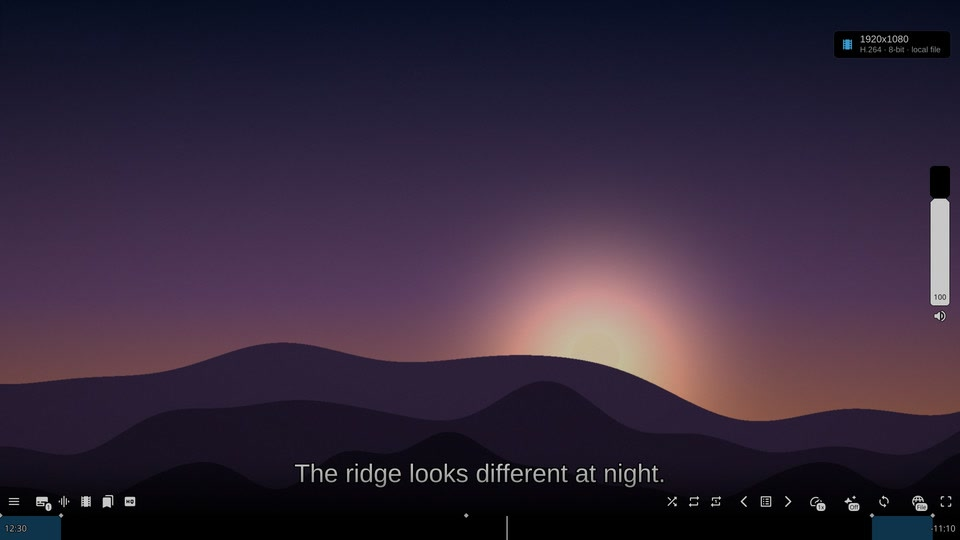
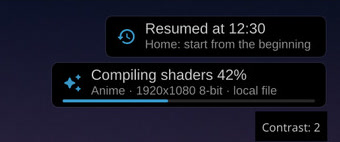
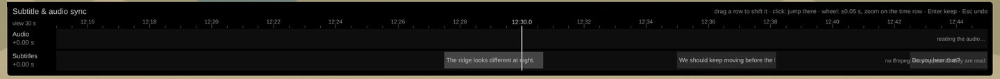
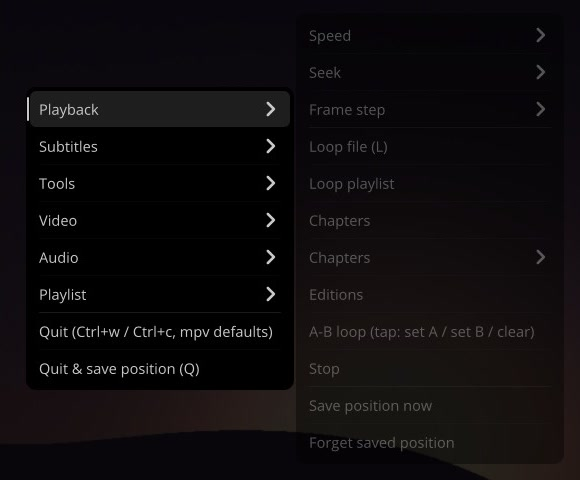

# mpv for Windows: anime and film setup

A portable [mpv](https://mpv.io/) setup for Windows. It has GPU upscaling
(Anime4K for anime, FSRCNNX + SSimSuperRes for films), shaders that compile in
the background before you need them, a timeline for fixing subtitle and audio
sync by eye, and a black, minimal [uosc](https://github.com/tomasklaen/uosc)
interface. Each choice was measured rather than guessed, and an automated test
suite checks every feature.



> **One PC, measured.** Everything here was tuned and measured on a Radeon
> RX 9070 XT with a 1440p IPS monitor (LG 27GN800-B) on Windows 11. It should
> work on any Windows PC with a Vulkan GPU, but only that machine has been
> tested. See [Settings tied to that PC](#settings-tied-to-that-pc).

## Features

**Upscaling you switch on, chosen by measurement**
- **Anime** (`Shift+A`): Anime4K's "Mode C+A" (HQ): denoised, cleanly inked lines.
- **Movie** (`Shift+Y`): picks a chain by the real display scale. Below 2x
  it uses SSimSuperRes; at 2x and above, FSRCNNX + SSimSuperRes. Chroma is
  rebuilt from luma (CfL), and adaptive sharpening runs at an automatic
  strength.
- Both were picked by scoring against original clean footage (PSNR, SSIM,
  VMAF, edge sharpness and halo). The harness is in
  [`tests/upscale-bench/`](tests/upscale-bench/) and the numbers are in the
  comment above `UPSCALE_ANIME` in
  [`gpu-toggles.lua`](portable_config/Scripts/gpu-toggles.lua). Settings that
  lost, and why, are recorded there too.
- Local files play without shaders until you pick a preset. Streams from
  FastStream (below) pick one automatically.

**Shaders compile before you need them**
- On start, mpv checks whether its shader cache matches the current driver,
  mpv build, shaders and config. If it doesn't, a second, hidden mpv draws
  every preset in every format in the background, with a small progress
  banner. Your video keeps playing and no frames are dropped.



**Subtitle and audio sync timeline** (`t`)
- Your subtitles and the audio's loudness are drawn on one timeline. Drag the
  subtitle row or the audio row until speech and text line up. `Enter` keeps
  the change, `Esc` undoes it.



**Interface**
- uosc with a soft control bar, Segoe UI and rounded corners, in OLED black.
  The Windows title bar is black too (Windows 11).
- Every message is a small banner top right. A resolution banner appears when
  a video starts.
- Subtitles move up above the controls while the controls are shown.
- Songs show "Artist – Title (feat. X)" in the window title, plus a details
  panel.
- A **source** button lists every link of the current file (stream URL,
  original page, local path) to copy or open.
- Right-click opens a menu with everything; see the screenshot below.

**Speed**
- Preset keys `r g b q w a y e h` (1x, 2x, 2.5x, 3x, 3.5x, 4x, 5x, 8x, 16x).
  Pressing the same key again goes back to the speed you had before.
  `s` / `d` change the speed by 0.1.
- The last speed is remembered across restarts, separately for videos and
  songs.

**Streams from the browser**
- Works with a [FastStream fork](https://github.com/Nawid3333/FastStream) for
  Firefox that hands browser videos to mpv. See
  [Use with FastStream](#use-with-faststream).

**Updates that are tested first**
- [`mpv-build.json`](mpv-build.json) pins one of [shinchiro's mpv builds](https://github.com/shinchiro/mpv-winbuild-cmake).
  A daily GitHub Actions job tries each new build against the test suite and,
  when all tests pass, offers it as one pull request (`mpv-update`) for the
  owner to merge. Nothing moves the pin by itself (since 2026-10-05).
- `updater.bat` pulls this repository, installs the pinned build (checking
  every file's SHA-256) and updates yt-dlp.



## Install

You need Windows 10 or 11 (x64), a GPU with a Vulkan driver, and
[Git](https://git-scm.com/) with Git LFS. PowerShell 7 is needed only for the
tests. ffmpeg on `PATH` is optional; the sync tool uses it to read subtitle
tracks inside a video.

```powershell
# 1. Clone the repository AS the mpv folder (mpv runs in portable mode next to portable_config\).
#    Any folder works. Under Program Files this needs an admin prompt, and mpv needs write access:
git clone https://github.com/Nawid3333/mpv-config.git "C:\Program Files\mpv"
icacls "C:\Program Files\mpv" /grant "$($env:USERNAME):(OI)(CI)M"
cd "C:\Program Files\mpv"

# 2. Install mpv itself (the pinned build) and yt-dlp. Run this again later to update:
.\updater.bat

# 3. Optional: file associations
.\mpv-register.bat
```

Play any video. The first time, a small banner top right shows the shaders
compiling in the background (under a minute, once per PC and again after
a driver update). Playback does not wait for it.

The full runbook (what each script does, troubleshooting, the commit guard) is
in [`RECREATE.md`](RECREATE.md).

## Use with FastStream

[Nawid3333/FastStream](https://github.com/Nawid3333/FastStream) is a Firefox
fork of FastStream that hands a video playing in the browser to mpv. This
config is built as its mpv side:

- **Upscaling picks itself.** The fork tags every stream as anime or movie
  (from your allowlist, see step 4). This config then applies Anime4K or the
  Movie chain automatically. Local files stay without shaders until you pick
  one.
- **Resume.** A stream continues where you stopped, even though its address
  changes on every visit. Saved positions last 7 days, and `Home` starts from
  the beginning.
- **Source button.** Shows the stream URL and the page it came from, ready to
  copy or to open in the browser.
- **One window.** The next episode replaces the current one in the same mpv
  window and starts playing. A pause or a subtitle delay from the previous
  episode does not carry over.
- **Decoding.** Streams and local files both decode with `d3d11va-copy` on the
  graphics card's video engine. Vulkan decoding is off since 2026-10-04: it lost
  the graphics device on this AMD card.
- **Clear errors.** If a stream cannot be opened (for example, an expired
  link), a banner says to reload the page instead of showing an empty window.

### Setup (once)

1. **Install this config** as above. The fork's helper looks for
   `C:\Program Files\mpv\mpv.exe` first.
2. **Install the extension.** Download the signed `.xpi` from the fork's
   [Releases](https://github.com/Nawid3333/FastStream/releases) and open it in
   Firefox 142 or newer. Firefox then updates it by itself.
3. **Install the helper.** A browser extension cannot start programs by
   itself, so a small helper is registered once. It needs
   [Node.js](https://nodejs.org/) 22 or newer. Get the fork's source (Code ▸
   Download ZIP, or `git clone`), then in PowerShell:

   ```powershell
   cd FastStream\native-host
   powershell -ExecutionPolicy Bypass -File install.ps1
   # mpv somewhere else? add:  -MpvPath "D:\Apps\mpv\mpv.exe"
   ```

   Then **restart Firefox**. No admin rights are needed; it only writes to
   `%LOCALAPPDATA%\FastStreamMpvHost` and one registry key under `HKCU`.
4. **Turn it on.** In FastStream's settings, go to **MPV Mode**:
   - Tick **Open detected streams in mpv**.
   - Click **Test mpv connection**. It should say **mpv found**.
   - Add your sites to the **MPV Allowlist**, one per line. Sites count as
     movies; put `@anime` after the anime ones:

     ```
     https://movies.example.com
     https://anime.example.org @anime
     ```

### Use it

- Open a video on an allowlisted site, and mpv takes over.
- On any other site, use the player's **Open this stream in mpv** button. Right-click
  that button to set Anime or Movie for one video.

The fork's [MPV mode guide](https://github.com/Nawid3333/FastStream/blob/main/README-MPV.md)
has every option, troubleshooting (a helper log you can switch on) and how to
uninstall. Only the stream URL, the page address and three headers (`Referer`,
`Origin`, `User-Agent`) go to mpv. Cookies stay in the browser, so a stream
that needs a login session will not play in mpv.

## Keys

| Key | Action |
|---|---|
| Click / double-click / right-click | Play-pause / fullscreen / menu |
| `Shift+A`, `Shift+Y` | Anime upscaling on/off, Movie upscaling on/off |
| `t` | Subtitle and audio sync timeline |
| `c` | Subtitles on/off (selects a track if none is chosen) |
| `r g b q w a y e h` | Speed 1x, 2x, 2.5x, 3x, 3.5x, 4x, 5x, 8x, 16x (again: back) |
| `s` / `d` | Speed -0.1 / +0.1 |
| `←` `→` / `j` `k` / `z` `x` | Seek 5 s / 10 s / 60 s |
| `0`-`9` | Jump to 0 %-90 % |
| `↑` `↓`, wheel, `m` | Volume ±10, ±2, mute |
| `i`, `I` | Stats |
| `Q` | Quit and save the position (`Ctrl+w` quits) |

Every key and menu entry is in [`input.conf`](portable_config/input.conf).

## Settings tied to that PC

- `target-peak=350` in [`mpv.conf`](portable_config/mpv.conf) is the measured
  peak brightness of the monitor above. It applies to HDR videos only; set it to
  your display's peak or remove it.
- `slang=de,en` / `alang=de,en`: German first, then English. Change them to
  your languages.
- `hwdec`: everything decodes with `d3d11va-copy`. Vulkan decoding dropped frames
  on long local files with this AMD driver (2026-09-16) and lost the graphics
  device on streams with the October 2026 builds (2026-10-04). `mpv.conf`
  explains it, and the static tests refuse a vulkan or auto `hwdec`.

## Tests

```powershell
pwsh tests/run-tests.ps1             # static + headless, ~1 min, no window
pwsh tests/run-tests.ps1 -Tier gpu   # the real renderer, fullscreen, ~5 min (close mpv first)
```

The headless tier runs a copy of mpv on a copy of the config, so your
settings, history and shader cache are never touched. It drives mpv with its
own input commands and checks that the banners are really drawn. CI runs
static + headless on every push. See [`tests/README.md`](tests/README.md).

## For contributors and AI agents

[`AGENTS.md`](AGENTS.md) holds detailed engineering notes: every feature,
why it is built that way, what was measured and what was rejected.
[`doc/history/`](doc/history/) has the session logs behind them.

This repository is a published copy of a private workspace. It is updated
automatically after each change passes the tests, and every update is checked
for personal data first. Commit hashes and pull request numbers in the notes
refer to that workspace. Issues are welcome; a pull request here is applied in
the workspace by hand, because the next update would overwrite a merge.

## License

MIT for the files written for this repository ([`LICENSE`](LICENSE)). Bundled
third-party files (uosc, thumbfast, the shaders, 7-Zip and others) keep their
own licenses; see [`THIRD-PARTY-NOTICES.md`](THIRD-PARTY-NOTICES.md).
